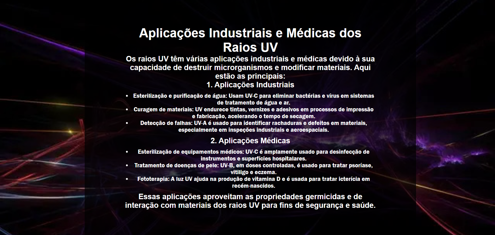

# Raios-UV
Este projeto, sob a supervisão de Ederson Pinheiro, tem como objetivo a criação de um site para passar informações sobre os Raios Ultravioletas(UV)

Produzido por ***Beatriz Vizeu*** e ***Laila Casadei Macêdo***

## Imagens

- O que são os Raios UV?

- Classificações

- Aplicações Industriais e Médicas 

